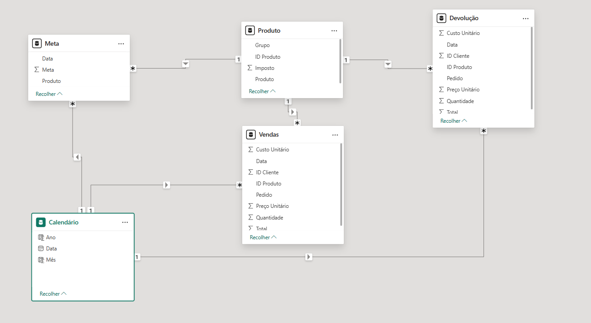

# Projeto_PBI_Análise_Vendas

Dashboard profissional de análise de vendas usando o Power BI.
Exploraremos as principais funcionalidades da ferramenta para importar,
transformar e visualizar dados de vendas, permitindo uma tomada de decisões mais
informada e eficiente.
Ideal para analistas de dados, gestores e qualquer pessoa interessada em
aprimorar suas habilidades em Business Intelligence.

## Importação de Dados

1.➡️ Devolução
2.➡️ Produto
3.➡️ Meta
4.➡️ Vendas

### Código de Importação

Param Font_caminho➡️ ={caminha independente da maquina usada}

1.➡️ Fonte_pasta

```powerquery
let
    Fonte = Folder.Files(Font_caminho)
in
    Fonte
```

O código lê o conteúdo de uma pasta e cria uma tabela listando todos os
arquivos que estão dentro dela.

2.➡️ Fonte_DadosProdutos

```powerquery
let
    Fonte = Fonte_pasta,
    #"Linhas Filtradas" = Table.SelectRows(
        Fonte, each ([Name] = "DadosProdutos.xlsx")
    ),
    Dados_bin_DadosProdutos = Table.AddColumn(
        #"Linhas Filtradas", "DadosProdutos", each Excel.Workbook([Content])
    ),
    #"Outras Colunas Removidas" = Table.SelectColumns(
        Dados_bin_DadosProdutos, {"DadosProdutos"}
    ),
    #"DadosProdutos Expandido" = Table.ExpandTableColumn(
        #"Outras Colunas Removidas", 
        "DadosProdutos",
        {"Name", "Data"}, 
        {"Name", "Data"}
    )
in
    #"DadosProdutos Expandido"
```

Este código faz o seguinte:
Ele procura por um arquivo específico chamado `DadosProdutos.xlsx` dentro de uma
pasta, abre esse arquivo e, em seguida, lista todas as tabelas e planilhas que
existem dentro dele.

3.➡️ Devolução

```powerquery
let
    Fonte = Fonte_DadosProdutos,
    Data = Fonte{3}[Data],
    #"Tipo Alterado" = Table.TransformColumnTypes(
        Data,
        {
            {"Pedido", type text},
            {"Data", type date},
            {"ID Cliente", Int64.Type},
            {"ID Produto", Int64.Type},
            {"Quantidade", Int64.Type},
            {"Preço Unitário", Currency.Type},
            {"Total", Currency.Type},
            {"Custo Unitário", Currency.Type}
        }
    )
in
    #"Tipo Alterado"

```

Este código faz o seguinte:
Ele pega uma tabela específica (a quarta da lista gerada anteriormente),
e em seguida, formata cada coluna para o tipo de dado correto
(texto, data, número, moeda).
Este é um passo de limpeza e preparação de dados essencial para garantir que
 cálculos e análises funcionem corretamente.

4.➡️ Produto

```powerquery
let
    Fonte = Fonte_DadosProdutos,
    Data = Fonte{4}[Data],
    #"Tipo Alterado" = Table.TransformColumnTypes(
        Data, {
            {"ID Produto", Int64.Type},
            {"Produto", type text},
            {"Grupo", type text},
            {"Imposto", Percentage.Type}
        }
    )
in
    #"Tipo Alterado"

```

Este código faz o seguinte:
Ele seleciona uma tabela diferente da consulta anterior (a quinta da lista),
que provavelmente é um cadastro de produtos, e formata suas colunas para os
tipos corretos: número, texto e percentual.

5.➡️ Meta

```powerquery
let
    Fonte = Fonte_DadosProdutos,
    Data = Fonte{5}[Data],
    #"Tipo Alterado" = Table.TransformColumnTypes(
        Data, {
            {"Data", type date}, 
            {"Produto", type text}, 
            {"Meta", Currency.Type}
        }
    )
in
    #"Tipo Alterado"
```

Este código faz o seguinte:
Ele seleciona a sexta tabela do arquivo Excel, que parece ser uma tabela de
metas de vendas, e a prepara para análise, formatando suas colunas como
data, texto e moeda.

6.➡️ Vendas

```powerquery
let
    Fonte = Fonte_pasta,
    #"Linhas Filtradas" = Table.SelectRows(Fonte,
        each ([Name] <> "DadosProdutos.xlsx")
    ),
    Dados_bin_vendas = Table.AddColumn(
        #"Linhas Filtradas", "Dados_Vendas", 
        each Excel.Workbook([Content])
    ),
    #"Outras Colunas Removidas" = Table.SelectColumns(
        Dados_bin_vendas, {"Dados_Vendas"}
    ),
    #"Dados_Vendas Expandido" = Table.ExpandTableColumn(
        #"Outras Colunas Removidas", "Dados_Vendas", 
        {"Name", "Data"}, 
        {"Name", "Data"}
    ),
    #"Linhas Filtradas Vendas" = Table.SelectRows(
        #"Dados_Vendas Expandido", each ([Name] = "Vendas")
    ),
    #"Data Expandido" = Table.ExpandTableColumn(
        #"Linhas Filtradas Vendas",
        "Data",
        {
            "Pedido", "Data", 
            "ID Cliente", 
            "ID Produto", 
            "Quantidade", 
            "Preço Unitário", 
            "Total", 
            "Custo Unitário"
        },
        {
            "Pedido", 
            "Data.1", 
            "ID Cliente", 
            "ID Produto", 
            "Quantidade", 
            "Preço Unitário", 
            "Total", 
            "Custo Unitário"
        }
    ),
    #"Colunas importantes" = Table.SelectColumns(
        #"Data Expandido",
        {
            "Pedido", 
            "Data.1", 
            "ID Cliente", 
            "ID Produto", 
            "Quantidade", 
            "Preço Unitário", 
            "Total", 
            "Custo Unitário"
        }
    ),
    #"Colunas Renomeadas" = Table.RenameColumns(
        #"Colunas importantes", 
        {{"Data.1", "Data"}}
    ),
    #"Tipo Alterado" = Table.TransformColumnTypes(
        #"Colunas Renomeadas",
        {
            {"Pedido", type text},
            {"Data", type date},
            {"ID Cliente", Int64.Type},
            {"ID Produto", Int64.Type},
            {"Quantidade", Int64.Type},
            {"Preço Unitário", Currency.Type},
            {"Total", Currency.Type},
            {"Custo Unitário", Currency.Type}
        }
    )
in
    #"Tipo Alterado"

```

Este código faz o seguinte:
Ele combina múltiplos arquivos de vendas do Excel que estão em uma pasta
em uma única tabela consolidada.
Para isso, ele ignora um arquivo específico `(DadosProdutos.xlsx)`, abre todos
os outros arquivos, extrai os dados da planilha chamada "Vendas" de cada um,
empilha tudo e, por fim, limpa e formata as colunas para garantir que a tabela
final esteja pronta para análise.

### Relacionamento de tabelas



#### A tabela calendário foi criada com as seguintes funções Dax

```dax
Calendário = CALENDARAUTO()
ADDCOLUN Ano = YEAR('Calendário'[Data])
ADDCOLUN Mês = MONTH('Calendário'[Data])
```

## Cálculo Imposto

Essa sintaxe é feita diretamente na tabela de vendas

```dax
ADDCOLUN Imposto = Vendas[Total]*RELATED(Produto[Imposto])

ADDCOLUN Lucro = Vendas[Total]-Vendas[Custo Unitário]-Vendas[Imposto]

```

## Medidas Dax

1.➡️ Total Vendas

```dax
Total Vendas = SUMX(Vendas,Vendas[Total])
```

Este código DAX cria uma medida chamada `Total Vendas`.
De forma simples, ela calcula a soma de todos os valores na coluna `[Total]` da
tabela `Vendas`.

2.➡️ Total Metas

```dax
Total Metas=SUMX(Meta,Meta[Meta])
```

Este código cria uma medida chamada `Total Metas`.
Ela simplesmente calcula a soma de todos os valores da coluna `[Meta]` que está
 na tabela `Meta`.

3.➡️ Ticket Médio

```dax
Ticket Médio = AVERAGEX(Vendas,[Total Vendas])
```

Este código cria uma medida chamada `Ticket Médio`.
Ela calcula o valor médio de cada venda individual. Essencialmente, ela pega o
`valor total` de todas as vendas e divide pelo número de vendas
(transações/pedidos) para encontrar a média.

4.➡️ Total de Lucro

```dax
Total Lucro = SUMX(Vendas,Vendas[Lucro])
```

Este código cria uma medida chamada `Total Lucro`.
Ele simplesmente soma todos os valores que estão na coluna `[Lucro]` da tabela
`Vendas`.

5.➡️ Margem de Lucro

```dax
Margem Lucro = DIVIDE([Total Lucro],[Total Vendas],0)
```

Este código DAX cria uma medida chamada `Margem Lucro`.
Ela calcula a margem de lucro dividindo o `Total Lucro` pelo `Total Vendas`.
A grande vantagem de usar a função `DIVIDE` é que ela evita erros de divisão por
zero: se o `Total Vendas` for zero, a fórmula retornará 0 em vez de um erro,
mantendo seus relatórios limpos.

6.➡️ Total de Devolução

```dax
Total Devolução = SUMX('Devolução','Devolução'[Total])
```

Este código cria uma medida chamada `Total Devolução`.
Ele simplesmente calcula a soma de todos os valores na coluna `[Total]` da
tabela `Devolução`. Basicamente, ele mede o valor monetário total de todos os
produtos que foram devolvidos.

7.➡️ Taxa de Devolução

```dax
Taxa Devolução = DIVIDE([Total Devolução],[Total Vendas])
```

Este código DAX cria uma medida chamada `Taxa Devolução`.
Ela calcula a proporção (ou percentual) do valor `total devolvido` em relação ao
valor `total vendido`. Em outras palavras, ela responde à pergunta: "De tudo o
que vendemos, qual porcentagem do valor está retornando como devolução?".
O uso da função DIVIDE protege o cálculo contra erros de divisão por zero,
retornando um valor em branco `(BLANK)` se não houver vendas.

8.➡️ Quantidade de Clientes

```dax
Quantidade Clientes = DISTINCTCOUNT(Vendas[ID Cliente])
```

Este código cria uma medida chamada `Quantidade Clientes`.
Ele conta o número de clientes únicos (distintos) que fizeram uma compra,
olhando para a coluna `ID Cliente` na tabela `Vendas`

9.➡️ Vendas vs Meta

```dax
Vendas vs Meta = DIVIDE([Total Vendas],[Total Metas],0)
```

Este código cria uma medida chamada `Vendas vs Meta`.
Ela calcula o percentual do `total de vendas` em relação ao `total de metas`
estabelecido. Essencialmente, responde à pergunta: "De toda a meta que
tínhamos, que porcentagem conseguimos atingir com nossas vendas?".
A função `DIVIDE` garante que o cálculo não retorne um erro se a meta for zero,
mostrando 0 nesse caso.

## Resultado Final


